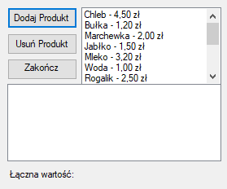

# Aplikacja Kasy Samoobsługowej

## Opis
Jest to podstawowa aplikacja z graficznym interfejsem do obsługi kasy samoobsługowej, z możliwością łatwego rozwoju funkcjonalności oraz poszerzenia asortymentu sklepu, bądź wprowadzenia jakichkolwiek zmian. Program napisany został stosując się do zasad programowania obiektowego, takimi jak enkapsulacja czy polimorfizm. Zachowana została czytelność, modularność oraz łatwość utrzymania kodu.

  

## Funkcje
- **Dodawanie przedmiotów do koszyka**: Użytkownicy mogą dodawać do koszyka przedmioty z różnych kategorii.
- **Edytowanie zawartości koszyka**: Użytkownicy mogą edytować dowolnie zawartość koszyka przed zfinalizowaniem transakcji.
- **Finalizowanie transakcji**: Użytkownicy mogą zfinalizować transakcję oraz zobaczyć podsumowanie transakcji.

## Instrukcje początkowe
Poniżej zamieszczona jest instrukcja początkowa użytkownia programu.

### Wymagania
Wymagany jest Microsoft .NET Framework wersja 4.7.2

### Instalacja
1. Klonowanie repozytorium:
    git clone https://github.com/AdrianBernas24/OstatecznaWersja.git
2. Import bazy:
	Importowanie bazy danych z pliku sql zawartym na githubie (products.sql).
3. Uruchomienie bazy:
	Należy uruchomić bazę na hoscie lokalnym.
4. Kompilacja programu:
	Wybranie SelfCheckoutGUI.sln w eksploratorze rozwiązań i uruchomienie kompilacji.

## Użytkowanie
Krótki opis korzystania z programu

### Dodawanie przedmiotów do koszyka
Aby dodać przedmiot do koszyka należy wybrać go na liście przedmiotów a następnie wcisnąć przycisk "Dodaj Produkt"

### Edytowanie zawartości koszyka
Aby edytować/usunąć zawartość koszyka należy wybrać produkt na liście koszyka a następnie wcisnąć "Usuń Produkt"

### Zakańczanie transakcji
Aby zakończyć transakcję należy wcisnąć przycisk "Zakończ Transakcję"

## Autorzy
-Adrian Bernaś

-Kamil Sitko

-Patryk Rylewicz

## Licencja
Projekt jest licencjonowany pod licencją MIT.
